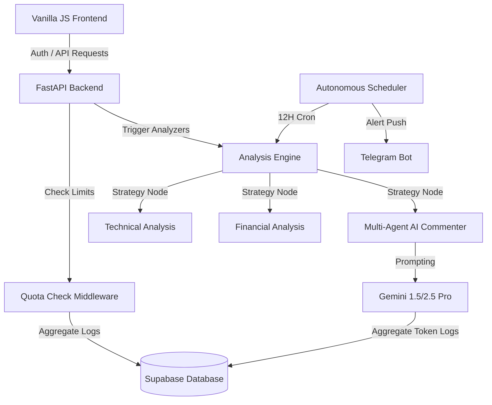

# 👑 AI Destekli Otonom Portföy Yöneticisi — v9.0

    

> **Varlıklarınızı matematiksel modeller ve akıllı multi-ajan (AI) mimarileriyle otonom olarak optimize edin.**

---

## 🚀 Temel Özellikler (Devasa Altyapı)

*   **🧠 Multi-Agent Orkestratörü (CIO):** Langchain tabanlı otonom AI ajanları piyasa trendlerini tarar, temel ve teknik verileri çarpıştırır ve profesyonel kurumsal analizler üretir.
*   **📊 Matematiksel Optimizasyon:** Markowitz (Efficient Frontier) ve Sharpe Ratio algoritmaları ile risk toleransınıza göre karlı portföy dağılım optimizasyonu.
*   **🛡️ Uçtan Uca Risk Motoru:** `Value at Risk (VaR)`, `Beta` ve `Maximum Drawdown (MaxDD)` parametreleriyle risk metriklerinizi ve geçmiş 5 yıllık stres testi simülasyonlarınızı (PV) çizer.
*   **💸 Sanal Paper Trading:** Gerçek bakiye riske etmeden karlı veya makul pozisyon dengelemelerini test edebileceğiniz tam entegre emir iletimi.
*   **🚨 Otonom Alarmlar (Telegram):** Arka planda 12 saatte bir çalışan zero-trust cron task'ları piyasa çöküşlerini veya sinyalleri yakalayarak doğrudan Telegram'ıza iletir.
*   **💳 Abonelik & Kota Yönetimi (Paywall):** LLM token limits (50.000 Free / 1.000.000 Pro) entegrasyonuyla güvenli platform ölçeklemesi.
*   **🔐 Supervisor Admin Paneli:** Platform sahipleri için anlık LLM maliyet giderlerini (Chart.js), aktif kullanıcıları ve AUM (Assets Under Management) listelerini izleme.
*   **🎭 Klasik & Profesyonel Görünüm (Adaptive UI):** Tek tıkla "Sade" (Beginner) ve "Quant" (Professional) görünümleri arasında geçiş yaparak analitik filtreleme.

---

## 📐 Sistem Mimarisi

Sistem, **FastAPI** ve **Multi-Agent Orkestrasyonu** etrafında tamamen asenkron olarak dekuple edilmiş mimariye sahiptir.



---

## ⚡ Hızlı Başlangıç (Quick Start)

### 🐳 1. Docker Compose ile Tek Tıkla Kurulum
Eğer sisteminizde Docker yüklüyse:

```bash
docker-compose up -d --build
```
*   **Frontend:** `http://localhost:3000`
*   **Backend:** `http://localhost:8000/docs`

---

### 🛠️ 2. Yerel Geliştirme Ortamı Kurulumu

#### Backend (FastAPI) Setup
```bash
cd backend
python3 -m venv venv
source venv/bin/activate
pip install -r requirements.txt
uvicorn api.main:app --reload --port 8000
```

#### Frontend Setup
```bash
# Frontend Vanilla JS ve HTML temelli olduğu için doğrudan bir http sunucuyla açabilirsiniz.
cd frontend
python3 -m http.server 5500
```
Tarayıcınızdan `http://localhost:5500` adresine gidin.

---

## 🔑 Gerekli Çevre Değişkenleri (Environment Variables)

Sisteminizin çalışması için `.env` dosyanızı aşağıdaki şablona göre doldurun:

```env
SUPABASE_URL=https://[YOUR_INSTANCE].supabase.co
SUPABASE_ANON_KEY=[YOUR_ANON_KEY]
SUPABASE_SERVICE_ROLE_KEY=[YOUR_SERVICE_KEY]
GEMINI_API_KEY=[YOUR_GEMINI_KEY]
TELEGRAM_BOT_TOKEN=[OPTIONAL_BOT_TOKEN]
```

---

## 🤝 Katkıda Bulunun (Contribution)

1.  Projeyi fork'layın (`Fork`)
2.  Yeni bir feature branch açın (`git checkout -b feature/awesome-feature`)
3.  Değişikliklerinizi commit edin (`git commit -m 'Add awesome feature'`)
4.  Branch'inizi push edin (`git push origin feature/awesome-feature`)
5.  Bir Pull Request (PR) açın

---

## 💖 Destekçilerimiz

Siz de projeyi desteklemek ve geliştirmelere katkı sağlamak istiyorsanız bir kahve ☕ ısmarlayabilirsiniz!
*(Sponsor kartı ve butonları destekleyici panellerde listelenmektedir)*
